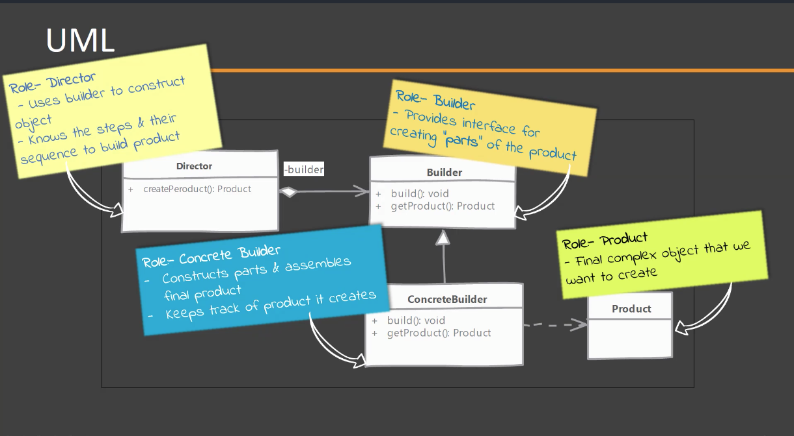
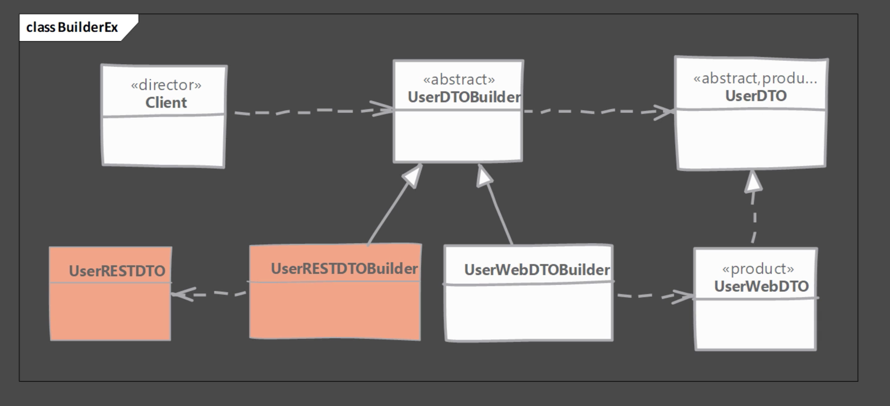

# Builder Pattern
- Cuando crear una instancia de una clase se convierte en un proceso complejo que involucra múltiples pasos, por ejemplo crear más objetos que se pasarán como parámetros en el constructor.
- En el patrón Builder se elimina la responsabilidad de manejar la lógica relacionada con la construcción del objeto al cliente. La lógica se abstrae en diferentes clases.

## Problemas que soluciona
- Creación de instancias de objetos inmutables.
- Creación de instancias donde el constructor tiene muchos parámetros y los parámetros son similares entre si.
- Objetos que necesitan otros objetos o partes de objetos pasa su propia construcción.

##Modelo de clases

Este es el modelo de clases genérico del patrón builder, donde cada clase juega un papel importante dentro de la implementación del patron. A continuación un ejemplo.

##Implementando el patrón Builder
- Primero se debe crear el Builder
    - Identificar las partes necesarias para la creación del objeto y proveer métodos en el Builder para crear estas partes. Cada método debe retornar una referencia al mismo objeto ***(Method chaining)***.
    - Proveer un método para construir el objeto, generalmente es el método build();
    - Se debe proveer un método que retorne el objeto completamente creado. Opcionalmente el builder puede mantener una referencia al objeto creado para que sea retornado de nuevo en el futuro. 
- Crear una clase que juegue el papel de director. Un cliente que sepa como utilizar el builder.

## Consideraciones
- Fácilmente se puede crear una clase inmutable implementando el builder como una inner static class. Es muy común encontrar este tipo de implementación, aún cuando la inmutabilidad no es el problema principal que se quiere atacar. Los setters se declaran como privados.
- El rol de director es muy raro encontrarlo como una clase separada, generalmente el consumidor del objeto o el cliente toma ese rol.
- Un builder abstracto no es necesario si el "producto" no es parte de un árbol de herencia. Se puede crear directamente un builder concreto.
- Si se debe solucionar un problema de "muchos argumentos en el constructor", es un buen indicador que se necesita implementar el patron builder.

## Ejemplos
- java.lang.StringBuilder
- java.io.ByteBuffer
- java.io.CharBuffer
- java.util.Calendar.Builder

## Diferencias con el patron Prototype
Builder | Prototype
------------ | -------------
Tenemos un constructor complejo y el builder nos permite trabajar con él |  Se utiliza el método clone(), para crear la instancia objeto
Se puede crear un builder como una clase separada, es posible trabajar con código legacy | Es necesario modificar el código existente y no se puede trabajar con código legacy

## La trampa!!
- Puede llegar a ser un poco complicado para novatos debido al concepto de "method chaining" donde el builder retorna una referencia a sí mismo.
_ Se peude presentar un escenario donde el objeto esté parcialmente inicializado 
