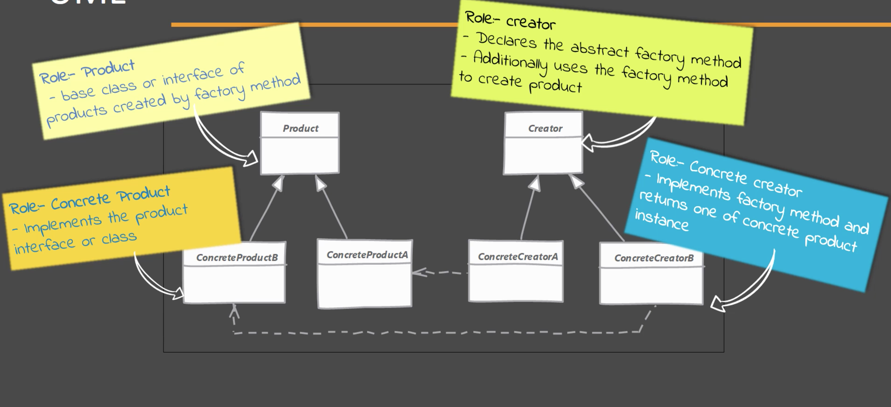
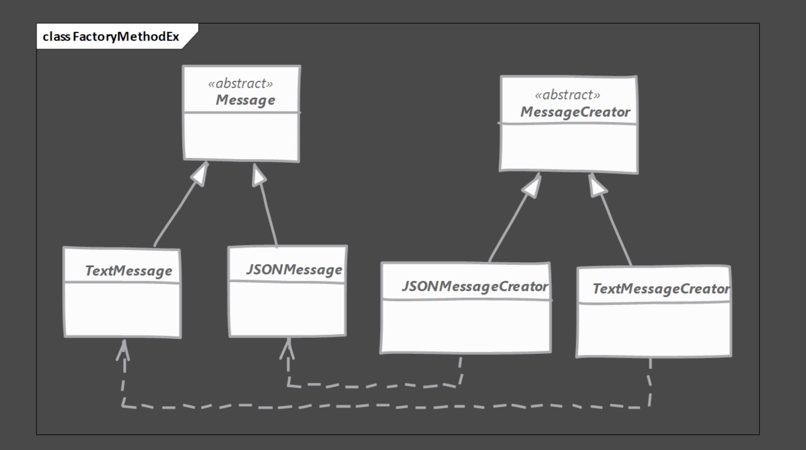

#Factory Method Pattern
- Se quiere mover la lógica de creación del objeto a una clase separada.
- Se usa este patrón cuando no se sabe anticipadamente qué clase se debe usar para isntanciar el objeto y se delega la responsabilidad de decidir a las subclases. Esto también permite a nuevas clases ser agregadas al sistema y manejar su creación sin afectar el código del cliente. 
- Se permite a las sub clases decidir qué objeto instanciar sobreescribiendo el método factory. 

## Problemas que soluciona
- Cuando la decisión de instanciar un objeto depende de una serie de validaciones como if en cascada o un Switch case. Si la variable == a, entonces cree un objeto tipo A, si la variable == b, entonces cree un objeto tipo B.

##Modelo de clases

Este es el modelo de clases genérico del patrón Factory Method. A continuación un ejemplo

##Implementando el patrón Simple Factory
- Primero se debe crear la clase Creator
    - El creator puede ser concreto si puede proveer un objeto por defecto o este puede ser abstracto.
    - Las implementaciones deben sobreescribir el método y retornar el objeto. 
    

## Consideraciones
- El Creator puede ser una clase concreta si y solo si puede proveer una implementación por defecto en el método que se encarga de construir la instancia.
- Se puede usar el patrón SimpleFactory para aceptar argumentos adicionales y escoger el tipo de clase que se usa para instanciar el objeto. Las subclases pueden sobreescribir el método "create()" para crear selectivamente diferentes objetos dependiendo del criterio.
- La jerarquía en el patrón Factory Method refleja la jerarquía del objeto que se desea crear. Generalmente se termina el árbol con un Creator concreto por cada tipo de objeto
- El patrón de diseño Template Method usualmente utiliza un Factory Method.
- Otro patrón creacional llamado Abstract Factory hace uso del patrón Factory Method.
  

## Ejemplos
- java.util.Collection
- java.util.AbstractCollection

## La trampa!!
- Puede llegar a ser complejo de implementar. Más clases están involucradas y por ende necesitan pruebas unitarias.
- Cuando se va a implementar el patrón, es recomendable hacerlo desde el principio, no es fácil hacer refactor de código que implementa este patrón.
- Cuando se agrega una nueva clase a la jerarquía, es necesario crear una subclase tipo Creator solo para crear una instancia de esta nueva clase.
