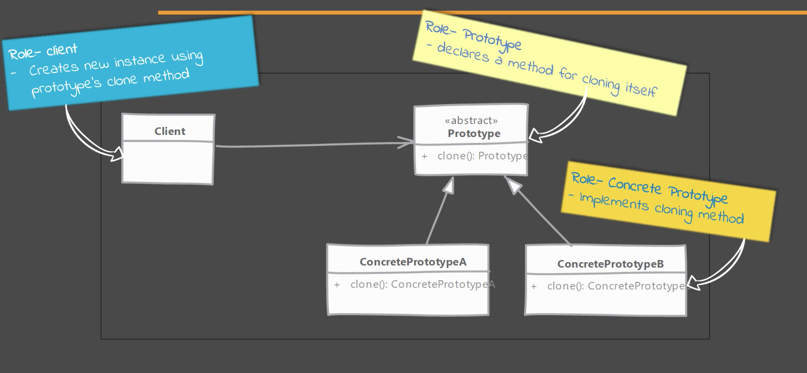
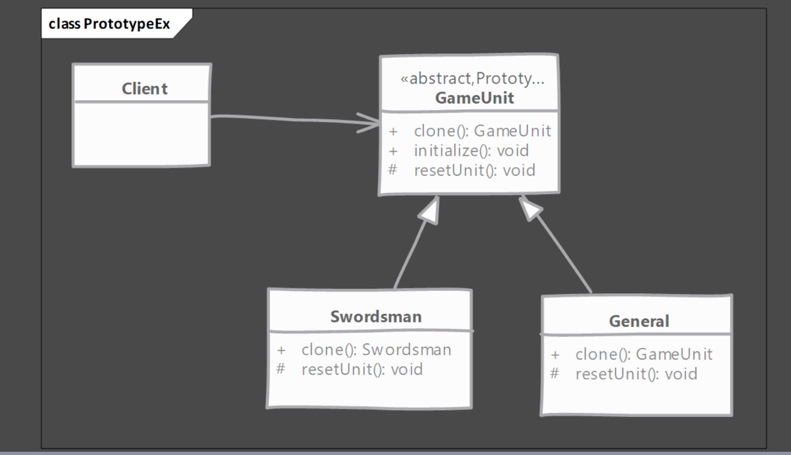

# Prototype Pattern
- Cuando se tiene un objeto complejo cuya construcción es costosa y se necesita crear más instancias de esta clase, usmos una instancia como prototipo.
- El patrón Prototype permite crear copias de un objeto existente , evitando crear de nuevo el objeto desde cero.

## Problemas que soluciona
- Cuando se tiene un objeto complejo cuya construcción es costosa y se necesita crear más instancias de esta clase, usmos una instancia como prototipo.

##Modelo de clases

Este es el modelo de clases genérico del patrón Prototype. A continuación un ejemplo

##Implementando el patrón Prototype
- Crear la clase que va a funcionar como prototipo
    - La clase debe implementar la interfaz Cloneable
    - La clase debe sobreescribir el método clone() y retornar una copia de la instancia.
    - El método debe declarar CloneNotSupportedException como posible excepción para dar a las subclases la posibilidad de decidir cuándo soportan la clonación.
- En la implementación del método clone() se debe tener en cuenta si se va a hacer una clonación profunda o superficial (deep or shallow). Una copia profunda significa que se crearán todos los objetos necesarios para la creación de la copia. Una copia superficial significa que se copian solo las propiedades del objeto. 

## Consideraciones
- Se debe prestar especial atención al tipo de clonación que se quiere implementar (deep or shallow) debido a la referencia a objetos inmutables que se puede presentar.
- Se debe asegurar que se resetean los estados mutables del objeto que se está clonando antes de retornar el prototipo. Es una buena idea implementar este método para permitir a las subclases inicializarse ellas mismas.
- El método clone() es tipo protected, este tipo se debe sobreescribir y poner de tipo public para que pueda ser llamado desde clases fuera del package origen.
- La interfáz Clonable es tipo marker, e indica que la clase que la implementa se puede clonar.
- Los prototipos son útiles cuando se tienen objetos grandes donde la mayoría de sus propiedades no cambian entre instancias, las propiedades que cambias son fácilmente identificables.
- Un Registry de prototipos es donde se pueden registrar varios prototipos para que otro código pueda acceder a las instancias que se pueden clonar. Esto soluciona el problema de obtener la instancia inicial.
- Prototipos son muy útiles cuando se utilizan los patrones Composite y Decorator 

## Ejemplos
- Object.clone()

## Diferencias con el patron Singlenton
Prototype | Singlenton
------------ | -------------
Se retorna una copia de la instancia, esto implica que son instancias diferentes | Se retorna la misma instancia siempre 
Algunas o incluso todas las propiedades de la instancia creada a partir de un prototipo pueden ser diferentes a las propiedades de la instancia original| Como se retorna siempre la misma instancia, el estado siempre es el mismo

## La trampa!!
- La usabilidad depende del número de propiedades que son inmutables o que pueden ser copiadas superficialmente. Un objeto que su estado esté comprometido con una gran cantidad de propiedades es complicado de clonar.
- En java, el método clone() por defecto realiza una clonación superficial. Si se quiere hacer una clonación profunda, se debe realizar la implementación.
- Teniendo en cuenta que las subclases son las que deciden si implementan o no el método clone(), el código que realiza a clonación debe lidiar con el hecho que el método pueda lanzar una excepción de tipo UnsupportedCloneException.
