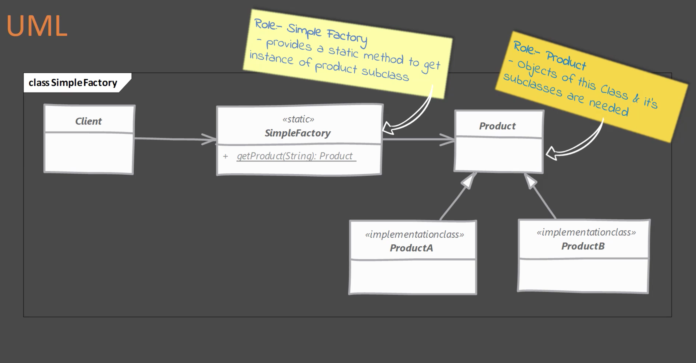
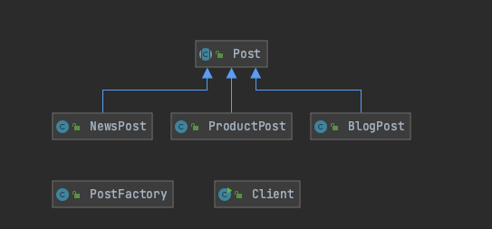

# Simple Factory Pattern
- Se mueve la lógica de instanciación del objeto a una clase separada, específicamente a un método estático de esa clase.
- Algunas personas no consideran Simple Factory como un patrón de diseño, debido a que es simplemente se encapsula la lógica de instanciación del objeto en un método.
- Típicamente se busca implementar este patrón cuando se tiene más de una opción para instanciar el objeto y se usa una lógica simple para decidir la clase correcta.

## Problemas que soluciona
- Cuando la decisión de instanciar un objeto depende de una serie de validaciones como if en cascada o un Switch case. Si la variable == a, entonces cree un objeto tipo A, si la variable == b, entonces cree un objeto tipo B.

##Modelo de clases

Este es el modelo de clases genérico del patrón simple Factory. A continuación un ejemplo

##Implementando el patrón Simple Factory
- Primero se debe crear una clase separada para implementar el patron Simple Factory
    - Agregar un método que retorne la instancia deseada.
      - Este método generalmente es estático y acepta algunos parámetros para decidir qué tipo de clase instanciar.
      - Se pueden proveer argumentos adicionales que serán usados para instanciar el objeto. 
    

## Consideraciones
- Simple Factory puede ser simplemente un método en una clase existente. Agregar una clase separada que se encargue de la creación del objeto, permite a otras clases usar la "factory" más fácilmente.
- Simple factory no necesita ningún seguimiento de estado, por esta razón es buena idea implementarlo en un método estático.
- Simple factory puede convivir sin ningún problema con otros patrones de diseño Creacionales para construir objetos.
- En caso que se desee especializar el patrón simple factory en sub clases, lo que se necesita es implementar un Factory method design pattern. 

## Ejemplos
- java.text.NumbersFormat

## Diferencias con el patron Factory method
Simple Factory | Factory Method
------------ | -------------
Se mueve la lógica de instanciación lejos del código del cliente. Generalmente en un método estático. |  Es más útil cuando se quiere delegar la creación de un objeto a una subclase
Conoce todas las clases que puede crear | No se conocen anticipadamente las clases que se puedan a crear. La decisión de creación es delegada a subclases

## La trampa!!
- El criterio usado para decidir qué objeto crear, puede ser más complejo con el tiempo. Debido a que pueden aparecer más condiciones. Si se encuentra una situación como esta, es mejor usar el patrón Factory Method.
